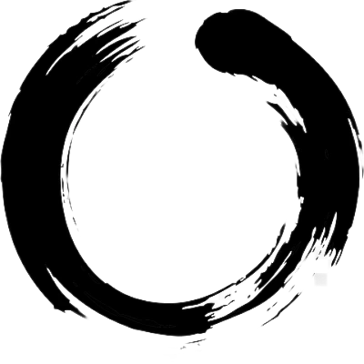

  

<h1 align="center">MaiZone 🌸</h1>

  <strong>Do one thing at a time</strong> 
  Extension giúp bạn tập trung sâu, nhắc nghỉ ngơi đúng lúc, và giữ sức khỏe khi làm việc trên máy tính

  
  
  

---

## Vấn đề

Bạn đang làm việc, bỗng dưng **"chỉ lướt Facebook 1 phút"**... rồi 30 phút sau mới nhận ra mình đang xem video mèo.

MaiZone sinh ra để giải quyết chuyện đó.

---

## Giải pháp

| Trước khi mở trang sao nhãng | Khi đang Deep Work |
|:---:|:---:|
|  |  |
| Mai hỏi: *"Bạn mở trang này để làm gì?"* | Timer 40 phút, 1 việc duy nhất |

---

## Tính năng chính

### 🚧 Hỏi lý do trước khi mở trang sao nhãng
Khi bạn mở Facebook, YouTube, TikTok... Mai sẽ hỏi lý do. Viết xong → được vào **5 phút**. Đủ để làm việc cần làm, không đủ để "lạc trôi".

### 🎯 Deep Work 40 phút
Nhập 1 việc cần làm → Enter → Mai đếm ngược 40 phút. Trong thời gian này, các trang nhắn tin (Messenger, Discord, WhatsApp) cũng bị hỏi lý do.

### 🧘 Nhắc thư giãn
Mỗi 15 phút, Mai nhắc bạn hít thở hoặc giãn cơ bằng thông báo nhẹ nhàng (không nhắc khi đang Deep Work).

### 🏋️ Nhắc tập thể dục
Mỗi 45 phút, Mai mời bạn làm vài động tác đơn giản: hít đất, gập bụng, squat.

### 📋 Copy Markdown nhanh (ClipMD)
Bấm `Alt + Q` → chọn vùng trên trang → tự động copy thành Markdown. Tiện khi ghi chú, viết blog.

---

## Cài đặt

### Cách 1: Cài thủ công (Developer Mode)

1. **Tải source code** - Clone repo hoặc [Download ZIP](../../archive/main.zip) rồi giải nén
2. **Mở Chrome** → gõ `chrome://extensions` → bật **Developer mode** (góc phải)
3. **Load extension** → bấm **Load unpacked** → chọn thư mục `mai-zone-main`
4. **Ghim icon** 🌸 lên thanh công cụ để truy cập nhanh

### Cách 2: Chrome Web Store
*(Sắp có)*

---

## Phím tắt

| Phím tắt | Chức năng |
|----------|-----------|
| `Alt + Q` | Copy Markdown (chọn vùng trên trang) |
| `Alt + A` | Thử nhắc thư giãn ngay |
| `Alt + Shift + A` | Thử nhắc tập thể dục ngay |
| `Alt + Z` | Bật/tắt Zen mode trên ChatGPT / Gemini |

---

## Omnibox (thanh địa chỉ)

Gõ `mai` + Space trên thanh địa chỉ, sau đó:

| Lệnh | Chức năng |
|------|-----------|
| `on` / `off` | Bật/tắt hỏi lý do |
| `deepwork 40` | Bắt đầu Deep Work 40 phút |
| `stop` | Dừng Deep Work |
| `mind on` / `mind off` | Bật/tắt nhắc thư giãn |
| `clip` | Bật chế độ copy Markdown |

---

## Quyền riêng tư 🔒

MaiZone được thiết kế **Privacy-first**:

- ✅ **Không** đọc mật khẩu
- ✅ **Không** lưu nội dung bạn gõ
- ✅ **Không** gửi dữ liệu ra ngoài
- ✅ **Không** có analytics, tracking
- ✅ Mọi dữ liệu chỉ lưu **trên máy bạn**

---

## FAQ

<strong>Tại sao chỉ cho phép 5 phút?</strong>

5 phút đủ để bạn reply tin nhắn hoặc check thông báo. Nếu cần lâu hơn, bạn luôn có thể nhập lý do mới. Việc phải dừng lại và suy nghĩ giúp bạn không "trôi" vô thức.

<strong>Tại sao Deep Work là 40 phút?</strong>

40 phút là khoảng thời gian đủ dài để đi sâu vào công việc, nhưng không quá dài để kiệt sức. Sau 40 phút, Mai sẽ nhắc bạn nghỉ ngơi.

<strong>Làm sao để thêm/bớt trang sao nhãng?</strong>

Click icon 🌸 → ⚙️ (Settings) → chỉnh danh sách trong trang Options.

<strong>Extension có hoạt động trên Edge/Brave/Opera không?</strong>

Có! MaiZone hoạt động trên tất cả trình duyệt Chromium-based.

---

## Đóng góp

Mọi đóng góp đều được chào đón! Xem [AGENTS.md](./AGENTS.md) để hiểu cấu trúc code và coding guidelines.

---

## Credits

- ClipMD dựa trên [AnswerDotAI/clipmd](https://github.com/AnswerDotAI/clipmd)

---

  <strong>🌸 Chúc bạn làm việc vui vẻ và tập trung!</strong>

